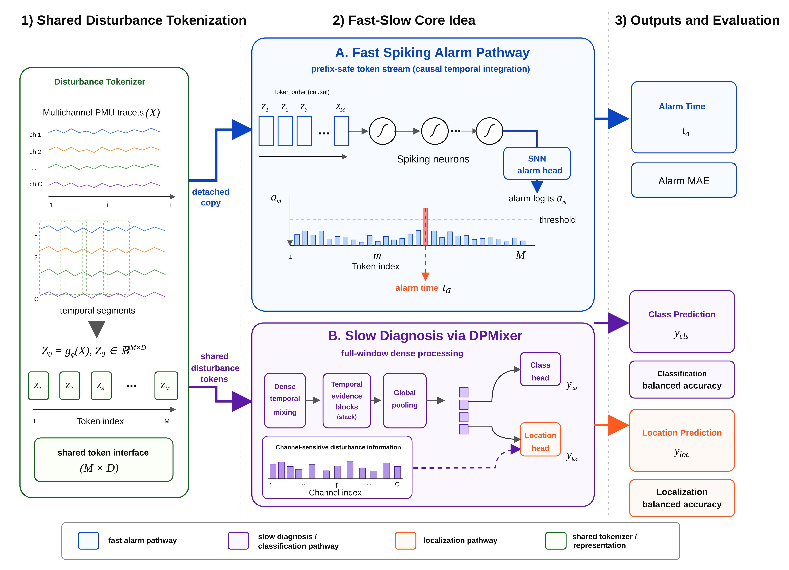
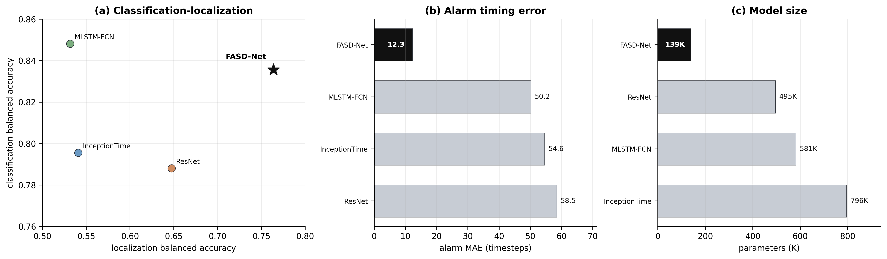
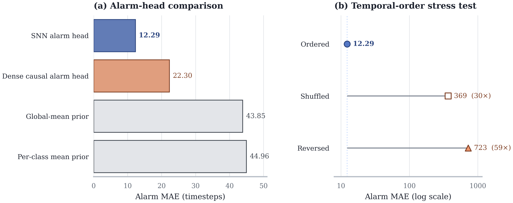
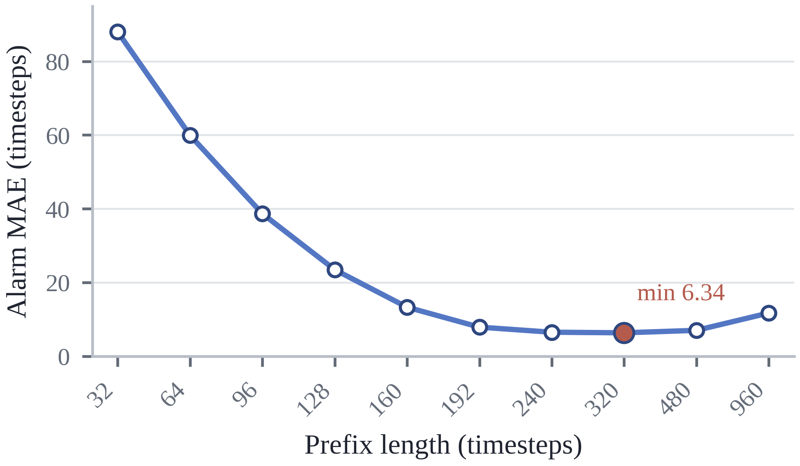

# FASD-Net

**Fast-Alarm and Slow-Diagnosis Network** for efficient power-system
disturbance perception on the
[PSML](https://github.com/tamu-engineering-research/Open-source-power-dataset)
benchmark.

**TL;DR:** full-window ANNs are good at stable disturbance diagnosis, while
causal alarm timing needs prefix-sensitive temporal evidence. FASD-Net fuses a
slow **DPMixer** pathway (classification + localization) with a fast causal
**spiking alarm head** (timestep-by-timestep alarm scores), forming a
complementary fast-alarm / slow-diagnosis mechanism instead of two redundant
classifiers.



## Key results

On the official PSML test split (110 samples, same protocol for all rows):

| Model | Cls BA | Loc BA | Alarm MAE | Parameters |
| --- | ---: | ---: | ---: | ---: |
| **FASD-Net (ours)** | **0.836** | **0.764** | **12.29** | **139.0K** |
| ResNet | 0.788 | 0.647 | 58.46 | 495.2K |
| InceptionTime | 0.796 | 0.541 | 54.59 | 795.6K |
| MLSTM-FCN | 0.848 | 0.532 | 50.20 | 581.2K |

FASD-Net reaches competitive classification, the strongest localization, and
the lowest alarm error with fewer parameters than all ANN baselines.



The alarm mechanism degrades sharply when token order is destroyed (shuffle
MAE ×30, reverse ×59), confirming that alarm timing is genuine prefix-sensitive
evidence rather than a by-product of full-window diagnosis:



Alarm MAE falls from 88.01 at a 32-step prefix to 6.34 at 320 steps, showing
that useful alarm evidence is available well before the full window:



## Repository layout

```text
src/fasdnet/models/   FASD-Net, DPMixer blocks, LIF neuron module
scripts/              training/evaluation runners and figure generation
results/              committed result tables (experiment records)
figures/              manuscript figures
```

## Requirement

```bash
python -m venv .venv
source .venv/bin/activate
pip install -r requirements.txt
```

## Data preparation

Download and extract the PSML dataset (Zenodo):

```bash
bash scripts/download_psml.sh
```

The runnable experiments need the official processed classification split at:

```text
data/PSML/processed_dataset/classification.pkl
```

Raw forecasting files and checkpoints are intentionally not tracked.

## Running the code

Main model (locked `FASDNET_CONFIG`):

```bash
python scripts/run_fasdnet.py \
  --variants FASDNET \
  --seeds 0 1 2 3 4 \
  --out-dir results/fasdnet/main
```

Alarm-mechanism controls (DPMixer-only, dense alarm head, FASD-Net, and
temporal-order controls; writes `alarm_control_table.csv` and the Fig. 3
source `alarm_mechanism.csv`):

```bash
python scripts/run_fasdnet_controls.py --seeds 0 1 2 3 4
```

Regenerate the figures from the committed result tables (no training run
needed):

```bash
python scripts/make_paper_figures.py                  # Fig. 2
python scripts/make_fasdnet_alarm_mechanism_figure.py # Fig. 3
python scripts/make_fasdnet_prefix_alarm_curve.py     # Fig. 4
```

## License

This repository is released under the [MIT License](LICENSE).
